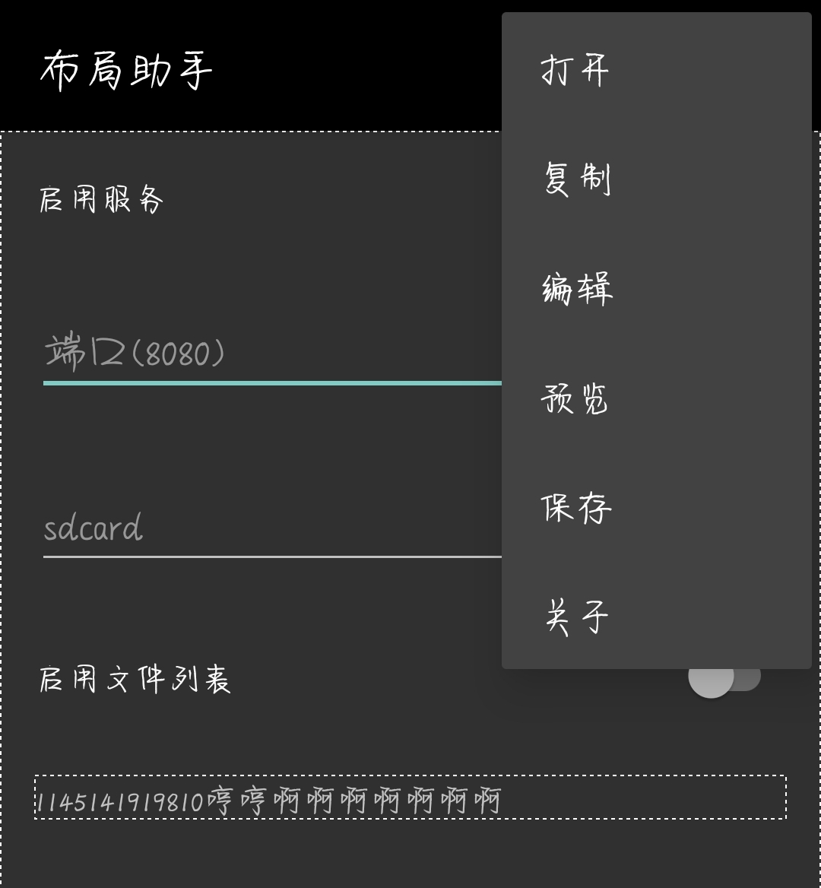
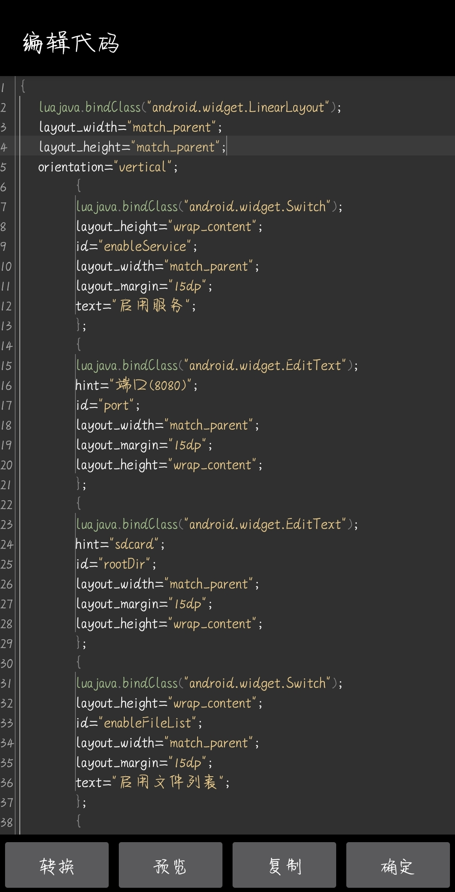

### LuaLayoutHelper

本软件在 [AndroLua_pro](https://github.com/nirenr/AndroLua_pro/) 自带的布局助手的基础上进行修改，使其更加易用，并赋予了 xml 布局的基础修改功能

#### 功能

* [x] 快速修改布局(建议先去学习 aly 布局的文本编辑，否则你可能会遇到一些问题)
* [x] 简单的 xml 布局修改支持
* [ ] 复杂 xml 文本转换
* [ ] 含自定义控件的布局修改(太难做了)

#### 截图

#### 编译

TODO

#### 许可

[AndroLua_pro](https://github.com/nirenr/AndroLua_pro/) - MIT

软件图标做得渣，随便用，不拿去盈利就行
